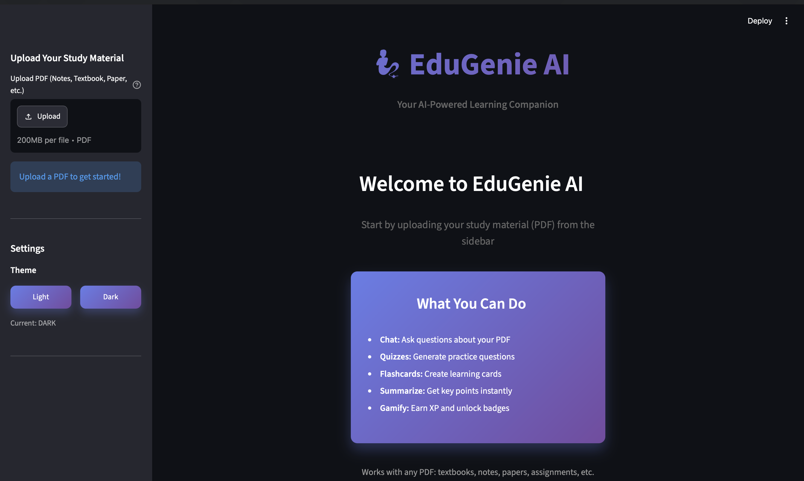
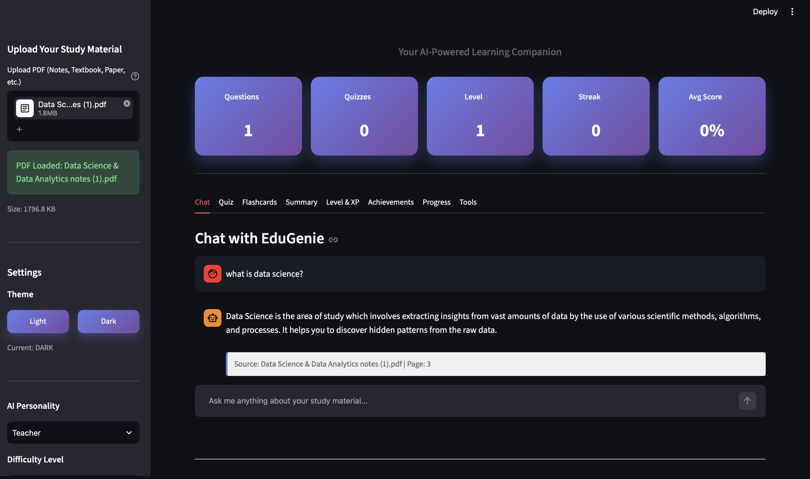
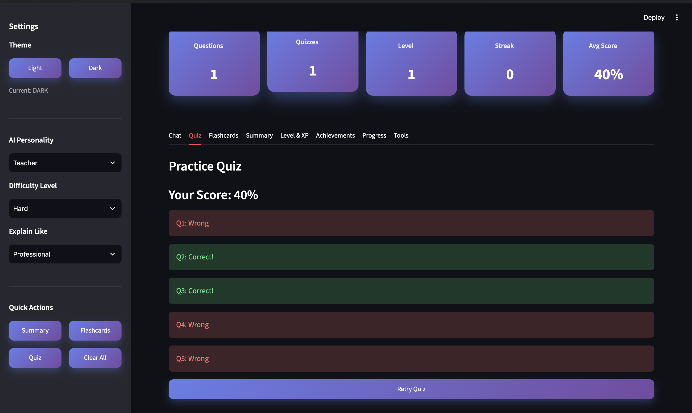
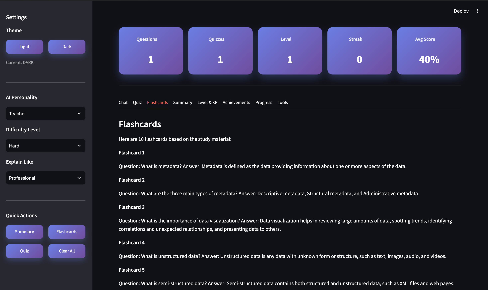
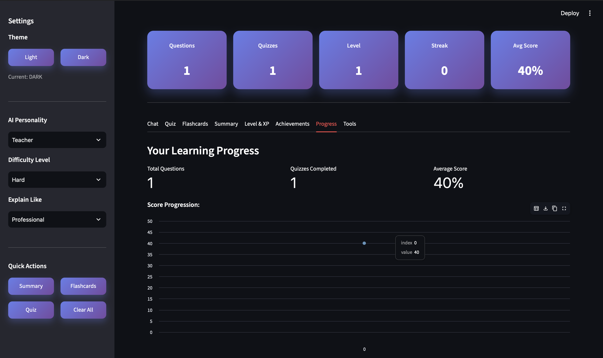
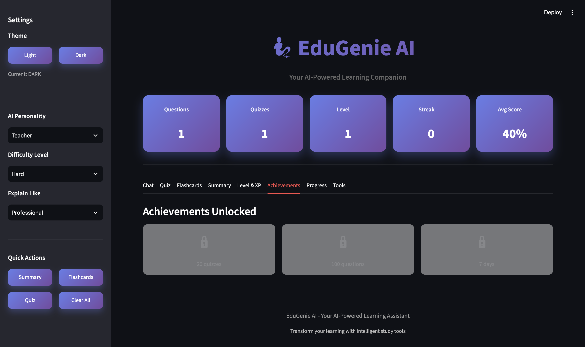

# 🧞 EduGenie AI — Intelligent Study Assistant

[](https://python.org)
[](https://streamlit.io)
[](https://python.langchain.com/)
[](https://github.com/facebookresearch/faiss)
[](LICENSE)

EduGenie AI is a Streamlit learning assistant that lets students upload a PDF and study it through document-grounded chat, quizzes, flashcards, summaries, and progress tracking. It uses Retrieval-Augmented Generation (RAG) to retrieve relevant material before generating an answer.

## Live demo

[Open EduGenie AI](https://edugenie-study-assistant.streamlit.app/)

## What it does

- Upload a PDF from the sidebar; the document is processed into a local FAISS vector store.
- Ask questions about the uploaded study material in the Chat tab.
- See a clean source citation with the uploaded filename and page number for each chat response.
- Generate a five-question multiple-choice quiz, submit answers, and review the result.
- Generate flashcards and a document summary from the uploaded material.
- Track questions, quizzes, XP, level, streak, average score, achievements, and quiz-score progression during the session.
- Switch between light and dark themes, choose an assistant persona, and select learning preferences from the sidebar.

## Current interface

The app starts with an upload-first screen. Once a PDF is loaded, EduGenie provides dedicated learning tools for document-grounded study.

### Dashboard



### Chat & RAG-based Question Answering



### AI-Generated Quiz



### Flashcards



### Learning Progress



### Achievements



Feature-specific screenshots will be refreshed as new captures are taken from this current interface.

## How RAG works

```text
PDF upload
   ↓
PyPDF extraction and text chunking
   ↓
HuggingFace sentence embeddings
   ↓
FAISS vector store
   ↓
Semantic retrieval
   ↓
OpenRouter LLM response with page-level citation
```

## Tech stack

| Area | Technology |
| --- | --- |
| User interface | Streamlit |
| Language | Python |
| RAG framework | LangChain |
| Embeddings | HuggingFace Sentence Transformers |
| Vector store | FAISS |
| PDF processing | PyPDF |
| LLM provider | OpenRouter |

## Project structure

```text
EduGenie-AI/
├── app.py                 # Main Streamlit application
├── streamlit_app.py       # Streamlit deployment entry point
├── backend/               # PDF, vector-store, LLM, and RAG modules
├── frontend/              # Reusable UI modules and styles
├── docs/screenshots/      # README interface captures
├── data/raw/              # Optional sample study material
├── requirements.txt
├── .env.example
└── .gitignore
```

## Run locally

1. Clone the repository and open the project folder.

   ```bash
   git clone https://github.com/agarwalkishu789-commits/EduGenie-AI.git
   cd EduGenie-AI
   ```

2. Create and activate a virtual environment.

   ```bash
   python3 -m venv .venv
   source .venv/bin/activate
   ```

   On Windows:

   ```powershell
   python -m venv .venv
   .venv\Scripts\activate
   ```

3. Install dependencies.

   ```bash
   pip install -r requirements.txt
   ```

4. Copy the example environment file and add your own OpenRouter key.

   ```bash
   cp .env.example .env
   ```

   ```env
   OPENROUTER_API_KEY=your_openrouter_api_key_here
   ```

   Never commit `.env`; it is intentionally ignored by Git.

5. Start the app.

   ```bash
   streamlit run app.py
   ```

   Then open `http://localhost:8501` and upload a PDF from the sidebar.

## Notes

- Answers are designed to be grounded in the uploaded PDF. If a topic is not found in the document, the assistant should say so.
- The vector index is rebuilt when a different PDF is uploaded.
- Session metrics reset when the browser session is refreshed.

## License

This project is licensed under the [MIT License](LICENSE).

## Developer

**Kishu Agarwal**  
PGDM (Business Analytics & AI)  
AI · Data Analytics · Generative AI Enthusiast

Developed as part of the Celebal Technologies Internship Program.
